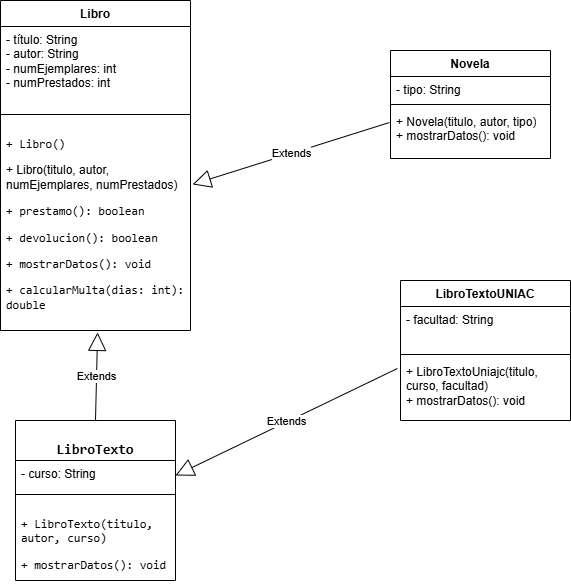

# Sistema de Gestión de Biblioteca
**Estudiante:** Eduar Renteria   

---

## Proceso
Para este parcial, seguí un flujo de trabajo dividido en estas etapas:

1. **Configuración de Entorno:** Creé un proyecto con estructura **Maven** para organizar el código en `src/main/java`.
2. **Modelado de Clases:** Definición de la lógica de negocio y atributos necesarios para la gestión bibliotecaria.
3. **Jerarquía de Herencia:** Implementación de niveles (Libro -> LibroTexto -> LibroTextoUniajc).
4. **Control de Versiones:** Uso de **Git** con commits descriptivos y gestión de ramas para cumplir con el flujo de trabajo solicitado.

---

## Diagrama de Clases UML
Aquí se representa la estructura

---

##  Especificaciones de las Clases y Atributos

###  Funcionalidad de cada Clase
* **Clase Libro (Superclase):** Actúa como la raíz de la jerarquía. Contiene la información esencial (título, autor, ejemplares) que comparten todos los libros, sin importar su tipo.
* **Clase Novela:** Especialización que añade el atributo `tipo` (Género literario) para categorizar obras de ficción.
* **Clase LibroTexto:** Clase derivada que organiza libros académicos mediante el atributo `curso`.
* **Clase LibroTextoUniajc:** El nivel más específico de herencia; hereda de `LibroTexto` e incluye la `facultad` correspondiente a la institución.

###  Atributos y Métodos
| Elemento | Propósito y Funcionalidad |

| **Atributos Privados** | Garantizan el **Encapsulamiento**, evitando que los datos sean modificados externamente sin pasar por los filtros de seguridad (getters/setters).| Atributos adicionales que permiten una identificación única y rastreo de la procedencia del material. |
| **Método prestamo()** | Controla el flujo de salida de libros. Solo permite el préstamo si el número de ejemplares disponibles es mayor a los ya prestados. |
| **Método devolucion()** | Gestiona el retorno de materiales. Actualiza el inventario restando de `numPrestados`, siempre validando que no existan valores negativos. |
| **Método mostrarDatos()** | Utiliza la **Sobrescritura de métodos** (@Override) para mostrar la información base del libro junto con los detalles específicos de cada subclase. |
| **Método calcularMulta()** | Lógica adicional que procesa el costo por retraso, demostrando la capacidad del sistema para manejar reglas de negocio financieras. |

---

## Conceptos Técnicos Aplicados

### Situaciones donde NO se puede realizar la herencia:
* **Clases Finales:** El uso del modificador `final` (ej. `public final class Libro`) bloquea por completo la posibilidad de que otras clases hereden de ella.
* **Constructores Privados:** Si el padre solo tiene un constructor `private`, el hijo no puede invocar al padre mediante `super()`, lo que impide la compilación de la herencia.

### Fallas :
* **Falla identificada:** El contador de libros prestados podría descender a números negativos si se ejecutan devoluciones sin control.
* **Solución técnica:** Se implementó una estructura condicional `if (numPrestados > 0)` para proteger la integridad de los datos en memoria.
